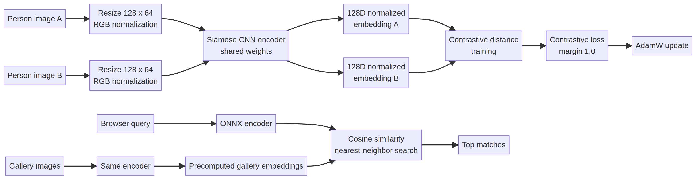

# Siamese Person Re-Identification

A compact Siamese-network person re-identification system that learns visual embeddings for cross-camera image retrieval. The project includes a PyTorch training pipeline, held-out evaluation, ONNX export, and a browser demo using ONNX Runtime Web.

> This is a research prototype for visual retrieval, not a biometric identification or surveillance system. Uploaded images are processed locally in the browser and are not sent to a server.

## How it works

Two person images pass through the same visual encoder during metric learning. The upgraded model uses a pretrained ResNet-18 backbone with a BatchNorm neck and a 256-dimensional normalized embedding. Identity classification and batch-hard triplet learning improve separation across people and cameras. During retrieval, the query vector is compared with precomputed gallery vectors using cosine similarity.

| Component | Implementation |
|---|---|
| Encoder | Pretrained ResNet-18 with BatchNorm neck and projection head |
| Embedding | 256-dimensional L2-normalized vector |
| Loss | Cross-entropy with label smoothing + batch-hard triplet loss |
| Training | Identity-balanced `8 × 4` batches, random erasing, warmup, cosine decay, seed `42` |
| Inference | ONNX Runtime Web in the browser |

## Dataset

The project uses a deterministic subset of the public [Market-1501 dataset][1]. Training and evaluation identities are disjoint so that retrieval is tested on identities not used for training.

| Split | Identities | Images | Purpose |
|---|---:|---:|---|
| Train | 100 | 795 | Contrastive pair training |
| Query | 100 | 200 | Held-out retrieval queries |
| Gallery | 100 | 854 | Retrieval candidates |

The dataset images are not committed to Git. The model artifacts and browser gallery included in `web/public` are already prepared for the demo.

## Results

The current browser demo uses the upgraded checkpoint trained for 12 epochs on the full Market-1501 training split: 12,936 images across 751 identities. The official evaluation contains 3,368 queries and 19,732 gallery images, with same-camera matches filtered during ranking.

| Full Market-1501 evaluation | Result |
|---|---:|
| Top-1 accuracy | **47.9%** |
| Top-5 accuracy | **72.0%** |
| Mean average precision | **0.2773** |

For a direct project-level comparison, both models were also evaluated on the 200-query / 854-gallery demo subset using the same same-camera-filtered protocol:

| Model | Top-1 | Top-5 | mAP |
|---|---:|---:|---:|
| Original compact CNN | 13.0% | 45.0% | 0.1848 |
| Upgraded ResNet-18 model | **62.0%** | **79.0%** | **0.5037** |

The subset comparison is useful for measuring the implementation change; the full-split numbers are the more realistic benchmark protocol and should not be compared directly with the original unfiltered smoke-test metrics.

## Installation

Install the Python dependencies:

```bash
pip install -r requirements.txt
```

The dataset archive can be downloaded from the public mirror below:

```bash
mkdir -p datasets
curl -L --fail -o datasets/Market-1501.zip \
  'https://huggingface.co/datasets/tuandunghcmut/MyPublicStorage/resolve/main/Market-1501-v15.09.15.zip?download=true'
unzip -q datasets/Market-1501.zip -d datasets
```

Prepare the deterministic subset under:

```text
data/market1501_subset/
├── train/
├── query/
└── gallery/
```

The training script validates the directories, filenames, and identity split before starting.

## Train and evaluate

The original compact Siamese smoke-test pipeline remains available:

```bash
python3 train_siamese.py \
  --data-root data/market1501_subset \
  --epochs 12 \
  --pairs-per-epoch 1200 \
  --batch-size 32
```

To train the stronger model on the full downloaded Market-1501 split:

```bash
python3 train_upgraded.py \
  --market-root datasets/Market-1501-v15.09.15 \
  --demo-root data/market1501_subset \
  --artifacts artifacts/upgraded \
  --epochs 12 \
  --batches-per-epoch 150 \
  --identities-per-batch 8 \
  --images-per-identity 4
```

The upgraded pipeline writes the full-split checkpoint and metrics to `artifacts/upgraded/`, then generates the browser model and gallery embeddings from the demo subset.

## Real-world manifest workflow

For an authorized site dataset, copy [`examples/site_manifest.template.csv`](examples/site_manifest.template.csv), fill it with pseudonymous IDs, cameras, sessions, quality fields, authorization status, and split assignments, then train through the same pipeline:

```bash
python3 train_upgraded.py \
  --manifest /path/to/site_manifest.csv \
  --artifacts artifacts/site_model \
  --epochs 20 \
  --batches-per-epoch 200
```

Evaluate the resulting model with camera-level metrics, calibrated review thresholds, and a content-addressed gallery version:

```bash
python3 evaluate_real_world.py \
  --manifest /path/to/site_manifest.csv \
  --model artifacts/site_model/strong_reid_market1501.pt \
  --gallery-json artifacts/site_model/gallery.json \
  --metrics-out reports/site_metrics.json \
  --version-out reports/site_gallery_version.json
```

The evaluator reports overall and per-camera retrieval metrics and produces a `match/review/no reliable match` threshold candidate. Use authorized data only; the manifest template does not include personal images or labels.

To evaluate an existing checkpoint and regenerate exports:

```bash
python3 evaluate_export.py \
  --data-root data/market1501_subset \
  --artifacts artifacts
```

## Run the browser demo

```bash
cd web
pnpm install
pnpm dev
```

The frontend loads the ONNX model, gallery embeddings, sample query, gallery images, and calibrated gallery version metadata from `web/public`. Image preprocessing, embedding extraction, and nearest-neighbor ranking run in the browser. The results screen distinguishes `REVIEW CANDIDATE` from `LOW CONFIDENCE`; it never presents a similarity score as proof of identity.

To test the production bundle locally:

```bash
cd web
pnpm build
pnpm preview --host 0.0.0.0 --port 4173
```

## Demo

Try the deployed browser demo: [Trace / Siamese Re-ID Lab](https://siamese-sg.vercel.app/)

The demo loads the ONNX model and performs image retrieval directly in the browser.

## Open-source self-hosting

The browser demo remains fully client-side, and an optional open-source FastAPI + FAISS service is included for local or independently managed deployments. See [`OPEN_SOURCE.md`](OPEN_SOURCE.md) for the license matrix, dataset restrictions, API endpoints, Docker Compose setup, and responsible-use requirements.

```bash
docker compose -f docker-compose.open-source.yml up --build
```

This starts the browser demo at `http://localhost:8080` and the review API at `http://localhost:8000/docs`.

## Architecture



## Repository structure

```text
src/reid_core.py       Original Siamese encoder, contrastive loss, pairs, metrics
src/realworld.py       Manifest loader, camera-aware sampler, gallery versioning
train_siamese.py       Compact pair-training pipeline and ONNX export
train_upgraded.py      Stronger full-split or manifest-backed training pipeline
evaluate_real_world.py Per-camera metrics and threshold calibration
examples/               Site manifest template
web/                   Vite browser application with confidence-aware review gate
server/app.py          Optional FastAPI + FAISS self-hosted review API
reports/               Baseline, upgraded, and real-world evaluation reports
OPEN_SOURCE.md         Open-source licenses and self-hosting guide
REAL_WORLD_DATA_PLAN.md Real-world data, evaluation, and rollout plan
ACCURACY_ROADMAP.md    Prioritized model-improvement plan
requirements.txt       Training dependencies
requirements-server.txt Optional self-hosted API dependencies
```

## References

[1]: https://zheng-lab-anu.github.io/Project/project_reid.html "Market-1501 dataset project page"

[2]: https://www.cs.utoronto.ca/~rsalakhu/papers/oneshot1.pdf "Koch, Zemel, and Salakhutdinov — Siamese Neural Networks for One-shot Image Recognition"

[3]: http://yann.lecun.com/exdb/publis/pdf/hadsell-chopra-lecun-06.pdf "Hadsell, Chopra, and LeCun — Dimensionality Reduction by Learning an Invariant Mapping"

[4]: https://www.cv-foundation.org/openaccess/content_iccv_2015/html/Zheng_Scalable_Person_Re-Identification_ICCV_2015_paper.html "Zheng et al. — Scalable Person Re-identification: A Benchmark"

[5]: https://arxiv.org/abs/1502.02171 "Liao et al. — Person Re-identification Meets Image Search"
```
