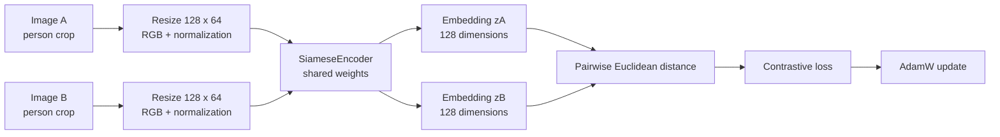

# Technical README: Siamese Person Re-Identification

## 1. Project overview

This repository implements a compact **Siamese neural network for person re-identification (ReID)**. The system receives a cropped person image, converts it into a normalized visual embedding, and retrieves the most similar gallery images from other camera views. The central design is metric learning rather than closed-set classification: the model learns a distance function that can generalize to identities that were not present during training.

The implementation is intentionally small enough to train locally and deploy as a static browser application. It uses PyTorch for training, ONNX for model interchange, ONNX Runtime Web for client-side inference, and Vite/Vercel for the web experience. The frontend does not send uploaded images to a backend; preprocessing, encoding, and nearest-neighbor ranking happen in the browser.

> **Scope and safety statement:** This is a research and engineering prototype for visual retrieval. It is not a biometric identification system, does not establish a person’s identity, and should not be used for surveillance, access control, law-enforcement decisions, or other high-impact decisions.

## 2. Why person re-identification needs metric learning

Person re-identification asks whether images captured by different cameras contain the same person. The challenge is that the same identity can change appearance because of viewpoint, illumination, pose, occlusion, camera quality, and background. At the same time, different people can share clothing colors, body shape, or scene context.

A conventional classifier learns a fixed set of training identities. That is not ideal for ReID because the gallery may contain identities that were never observed during training. A Siamese model instead learns an embedding function `f(x)` such that images of the same identity are close and images of different identities are separated by a margin. Once the embedding function is trained, retrieval can be performed against a new gallery without retraining the classifier.

The method follows the Siamese metric-learning formulation introduced for one-shot image recognition [1] and uses the margin-based contrastive objective described by Hadsell, Chopra, and LeCun [5]. The application domain is based on the Market-1501 person ReID benchmark [2].

## 3. Conceptual model

The two input images are processed by the **same encoder with shared parameters**. Weight sharing is the key Siamese property: the network cannot learn one representation for the left image and a different representation for the right image. Both images must be mapped into the same feature space.



During inference, only one image is encoded at a time. The gallery is encoded offline once, and the query embedding is compared with the stored gallery embeddings using cosine similarity. Because the model outputs L2-normalized vectors, cosine similarity and Euclidean distance are directly related:

```text
||z||₂ = 1
cosine_similarity(zq, zg) = zq · zg
squared_euclidean_distance(zq, zg) = 2 - 2(zq · zg)
```

## 4. Mathematical formulation

Let `fθ(x)` denote the encoder with parameters `θ`, and let `y` be the pair label. In this repository, `y = 0` means that the two images depict the same identity and `y = 1` means that they depict different identities.

The model first produces normalized embeddings:

```text
z₁ = normalize(fθ(x₁))
z₂ = normalize(fθ(x₂))
D = ||z₁ - z₂||₂
```

The implemented contrastive loss is:

```text
L(x₁, x₂, y) = (1 - y) D² + y max(m - D, 0)²
```

where `m` is the margin. The implementation uses `m = 1.0`. For a positive pair, the loss penalizes distance directly. For a negative pair, the loss is zero once the embeddings are at least one margin unit apart. This encourages the network to learn an identity-sensitive geometry without requiring a classifier head over all possible people.

The exact code is in [`src/reid_core.py`](src/reid_core.py), specifically `SiameseEncoder`, `ContrastiveLoss`, and `PairDataset`.

## 5. Encoder architecture

The deployed encoder is a compact convolutional network rather than a large pretrained ReID backbone. This choice keeps the model small enough for browser inference and makes the experiment reproducible on a CPU-only environment.

| Stage | Operation | Output channels / role |
|---|---|---:|
| Input | RGB image resized to `128 × 64` | 3 channels |
| Block 1 | `5 × 5` convolution, stride 2, BatchNorm, ReLU, max pooling | 32 |
| Block 2 | `3 × 3` convolution, BatchNorm, ReLU, max pooling | 64 |
| Block 3 | `3 × 3` convolution, BatchNorm, ReLU, max pooling | 128 |
| Block 4 | `3 × 3` convolution, BatchNorm, ReLU | 256 |
| Aggregation | Adaptive average pooling to `1 × 1` | 256 features |
| Projection | Linear layer | 128-dimensional embedding |
| Output | L2 normalization | Unit-length vector |

The adaptive pooling layer removes dependence on the intermediate spatial dimensions after the fixed input resize. The final normalization makes dot products usable as cosine similarity scores and prevents embedding magnitude from dominating retrieval.

## 6. Input preprocessing and augmentation

Every image is converted to RGB, resized to the native Market-1501 aspect ratio of height 128 and width 64, converted to a float tensor, and normalized with ImageNet-style channel statistics. The training pair loader applies horizontal flipping independently as a lightweight augmentation. Evaluation and browser inference do not apply random augmentation.

The preprocessing code is shared between training and export-oriented evaluation in `src/reid_core.py`. The browser implementation mirrors the same channel ordering, image dimensions, and normalization in `web/src/main.js`. Keeping those operations aligned is essential: a model can appear to load correctly while producing poor retrieval if the browser preprocessing differs from training preprocessing.

## 7. Dataset: Market-1501

Market-1501 is a public person ReID benchmark collected across six cameras. The official dataset page reports 1,501 identities and 32,668 annotated pedestrian bounding boxes, with separate training, query, gallery, and ground-truth components [2]. The original archive is intentionally not committed to this repository because it contains thousands of image files.

For a fast reproducible experiment, this project uses a deterministic subset prepared from the public Market-1501 archive. Training identities and evaluation identities are disjoint. This is important because the purpose of ReID metric learning is to generalize the learned visual similarity function to identities not used for parameter updates.

| Split | Identities | Images | Use |
|---|---:|---:|---|
| `train` | 100 | 795 | Positive and negative pair sampling |
| `query` | 100 | 200 | Held-out retrieval queries |
| `gallery` | 100 | 854 | Held-out retrieval candidates |

The subset uses the Market-1501 filename convention `<person_id>_c<camera_id>...jpg`. The parser extracts the identity and camera identifiers from each filename. A training assertion verifies that no identity appears in both the training and evaluation sets.

### Dataset acquisition

The official benchmark page should be treated as the primary dataset reference [2]. The experiment archive was downloaded from the following public mirror:

```text
https://huggingface.co/datasets/tuandunghcmut/MyPublicStorage/resolve/main/Market-1501-v15.09.15.zip?download=true
```

The archive can be downloaded and extracted with:

```bash
mkdir -p /home/ubuntu/datasets
curl -L --fail -o /home/ubuntu/datasets/Market-1501-v15.09.15.zip \
  'https://huggingface.co/datasets/tuandunghcmut/MyPublicStorage/resolve/main/Market-1501-v15.09.15.zip?download=true'
unzip -q /home/ubuntu/datasets/Market-1501-v15.09.15.zip \
  -d /home/ubuntu/datasets
```

The original subset preparation selected the first 100 identities available in `bounding_box_train`, then selected the first 100 query identities not present in the training set. It copied bounded numbers of images into `data/market1501_subset/train`, `data/market1501_subset/query`, and `data/market1501_subset/gallery`. The downloaded dataset and generated local subset are ignored by Git.

## 8. Pair construction

`PairDataset` builds pairs on demand rather than writing a large pair manifest to disk. Even-numbered dataset indices generate positive pairs; odd-numbered indices generate negative pairs. Positive pairs sample two images from one identity. Negative pairs sample one image from each of two different identities.

The default training run generates 1,200 pairs per epoch, with an approximately balanced positive/negative pattern. Pair selection uses `random.Random(seed + index)`, which makes the sampled pair for a given index reproducible when the seed is unchanged. The `DataLoader` uses `num_workers=0` to reduce platform-dependent worker behavior and simplify reproducibility.

## 9. Training configuration

The training entry point is [`train_siamese.py`](train_siamese.py). It performs dataset loading, identity-disjointness validation, pair sampling, model construction, optimization, checkpointing, embedding extraction, retrieval evaluation, gallery JSON generation, and ONNX export.

| Parameter | Default |
|---|---:|
| Epochs | 12 |
| Pairs per epoch | 1,200 |
| Batch size | 32 |
| Embedding dimension | 128 |
| Contrastive margin | 1.0 |
| Initial learning rate | 0.001 |
| Weight decay | 0.0001 |
| Optimizer | AdamW |
| Scheduler | CosineAnnealingLR |
| Gradient clipping | 5.0 |
| Random seed | 42 |
| Input size | `3 × 128 × 64` |

The model is saved when the current epoch has the lowest training loss observed so far. The checkpoint contains the model state dictionary, embedding dimension, image size, margin, and seed. For a more rigorous research experiment, validation loss, cross-camera filtering, hard-negative mining, and multiple random seeds should be added; the present pipeline prioritizes clarity and local reproducibility.

Run training with:

```bash
python3 train_siamese.py \
  --data-root data/market1501_subset \
  --epochs 12 \
  --pairs-per-epoch 1200 \
  --batch-size 32
```

The generated local artifacts are:

```text
artifacts/
├── siamese_market1501.pt       # PyTorch checkpoint
├── siamese_encoder.onnx        # self-contained browser model
├── gallery.json                # gallery metadata + embeddings
├── metrics.json                # retrieval metrics
└── history.json                # epoch-level training history
```

## 10. Evaluation protocol and metrics

The evaluation process encodes every query and gallery image, computes a pairwise similarity matrix, ranks the gallery for each query, and checks whether gallery images with the same person identifier appear near the top. The implementation currently treats all same-identity gallery images as relevant and does not apply the full Market-1501 `good`/`junk` camera filtering protocol. Therefore, the numbers below are subset-prototype measurements and should not be compared directly with official benchmark leaderboards.

### Top-1 and Top-5 accuracy

For each query, Top-1 is one when the highest-ranked gallery image has the same identity. Top-5 is one when at least one of the five highest-ranked gallery images has the same identity. The reported score is the mean over all queries.

### Mean average precision

For each query, the ranked gallery is converted into a binary relevance vector. Precision is computed at each rank where a relevant image occurs, and those precision values are averaged over all relevant images for that query. The final mAP is the mean of query-level average precisions.

### Measured results

The recorded run used seed 42, 12 epochs, 1,200 pairs per epoch, and the identity-disjoint subset described above.

| Metric | Value |
|---|---:|
| Queries | 200 |
| Gallery images | 854 |
| Training images | 795 |
| Training identities | 100 |
| Evaluation identities | 100 |
| Top-1 accuracy | **58.5%** |
| Top-5 accuracy | **82.5%** |
| Mean average precision | **0.3296** |

The source metrics are stored in [`reports/metrics.json`](reports/metrics.json), and the training curve values are stored in [`reports/training_history.json`](reports/training_history.json). These results demonstrate that the pipeline is functioning, but they are not a claim of state-of-the-art performance.

## 11. ONNX export and browser inference

The PyTorch encoder is exported to ONNX with a dynamic batch dimension, input name `images`, output name `embeddings`, opset 18, and `external_data=False`. A self-contained file is used because ONNX Runtime Web cannot rely on the mounted external-data mechanism used by some ONNX exports.

The frontend loads the model using `onnxruntime-web`. The application performs the following sequence:

```text
1. Read an uploaded image locally with FileReader.
2. Draw it into a 64 × 128 canvas.
3. Apply the same RGB normalization as the Python pipeline.
4. Create a [1, 3, 128, 64] float32 tensor.
5. Run the ONNX model in the browser.
6. Normalize the query embedding.
7. Compute dot products against precomputed gallery embeddings.
8. Sort by similarity and render the top ten results.
```

The static assets are located under `web/public`:

```text
web/public/
├── model/siamese_encoder.onnx
├── data/gallery.json
├── data/demo-query.jpg
└── gallery/*.jpg
```

The gallery JSON contains the filename, person identifier, camera identifier, public image path, and rounded embedding vector for each gallery image. The deployment does not need a Python server, GPU, API key, database, or image-upload endpoint.

## 12. Web application structure

The frontend is a Vite application with a deliberately small runtime surface.

| File | Responsibility |
|---|---|
| `web/index.html` | Semantic page structure and accessibility labels |
| `web/src/main.js` | ONNX session loading, preprocessing, inference, ranking, and UI state |
| `web/src/style.css` | Responsive Trace/Lab visual system, panels, results grid, and motion |
| `web/public/model/siamese_encoder.onnx` | Browser inference model |
| `web/public/data/gallery.json` | Precomputed retrieval index |
| `web/public/gallery/` | Static gallery images |
| `web/vercel.json` | Configuration when Vercel Root Directory is `web` |

The project deliberately uses a browser-only architecture for the public demo. This keeps uploaded images local to the user’s browser and avoids deploying a heavyweight Python runtime to a serverless function.

## 13. Local web development

From the repository root:

```bash
cd web
pnpm install
pnpm dev
```

For a production-style local check:

```bash
cd web
pnpm build
pnpm preview --host 0.0.0.0 --port 4173
```

The production build should contain `dist/index.html`, the bundled JavaScript and CSS, the ONNX Runtime Web WASM asset, the ONNX model, gallery JSON, sample query, and gallery images.

## 14. Vercel deployment

When importing the GitHub repository into Vercel, use the `web` directory as the project Root Directory. The nested `web/vercel.json` is configured for this arrangement:

| Vercel setting | Value |
|---|---|
| Root Directory | `web` |
| Framework Preset | `Vite` |
| Install Command | `npm install --no-audit --no-fund` |
| Build Command | `npm run build` |
| Output Directory | `dist` |
| Environment variables | None |

The root-level `vercel.json` remains available for deployments configured from the repository root, but the most reliable dashboard configuration is Root Directory `web` with commands that do not contain `cd web`. The distinction matters because Vercel executes commands relative to the selected Root Directory.

## 15. Reproducibility checklist

A reproducible run should use the same dataset subset, seed, input dimensions, normalization constants, pair-generation policy, embedding dimension, margin, optimizer, and training schedule. The following checklist captures the required conditions:

| Check | Expected value |
|---|---|
| Dataset identities | Train and evaluation identities are disjoint |
| Seed | 42 |
| Image tensor | `float32`, shape `3 × 128 × 64` |
| Normalization | Mean `[0.485, 0.456, 0.406]`; std `[0.229, 0.224, 0.225]` |
| Positive label | 0.0 |
| Negative label | 1.0 |
| Margin | 1.0 |
| Embedding | L2-normalized, 128 dimensions |
| Gallery score | Query/gallery dot product |
| Browser preprocessing | Matches Python preprocessing |

For stronger scientific reporting, repeat the experiment across several seeds, retain a validation split, report confidence intervals, apply the official Market-1501 evaluation protocol, and compare against stronger ReID backbones such as OSNet or ResNet-based baselines.

## 16. Known limitations

The current model is a compact prototype trained on a small subset rather than the full Market-1501 training set. Its training objective uses sampled pairs and does not perform hard-negative mining. It does not implement camera-aware `good`/`junk` filtering from the full benchmark evaluation protocol. The browser gallery is also a fixed precomputed index, so adding new gallery images requires regenerating embeddings and redeploying the static assets.

The system should not be interpreted as robust identity recognition in uncontrolled real-world environments. Performance may degrade under different camera domains, clothing changes, occlusion, crowding, unusual poses, image compression, or demographic distribution shifts. The public demo displays dataset identifiers for technical inspection; a production system should use privacy-preserving identifiers and appropriate governance.

## 17. Future work

The most useful next steps are to train on the complete allowed Market-1501 training split, add a validation protocol, implement official cross-camera evaluation, use semi-hard or batch-hard negative mining, compare multiple backbones, calibrate similarity thresholds, add gallery management, and measure latency and memory on representative mobile browsers. A production deployment should also define data-retention rules, user consent, access control, audit logging, and an explicit prohibition on high-impact biometric use.

## References

[1]: https://arxiv.org/abs/1503.03832 "Siamese Neural Networks for One-shot Image Recognition"

[2]: https://zheng-lab-anu.github.io/Project/project_reid.html "Market-1501 Dataset official project page"

[3]: https://github.com/going-doer/Paper2Code "Paper2Code repository"

[4]: https://vercel.com/docs/deployments "Vercel deployment documentation"

[5]: http://yann.lecun.com/exdb/publis/pdf/hadsell-chopra-lecun-06.pdf "Dimensionality Reduction by Learning an Invariant Mapping"
